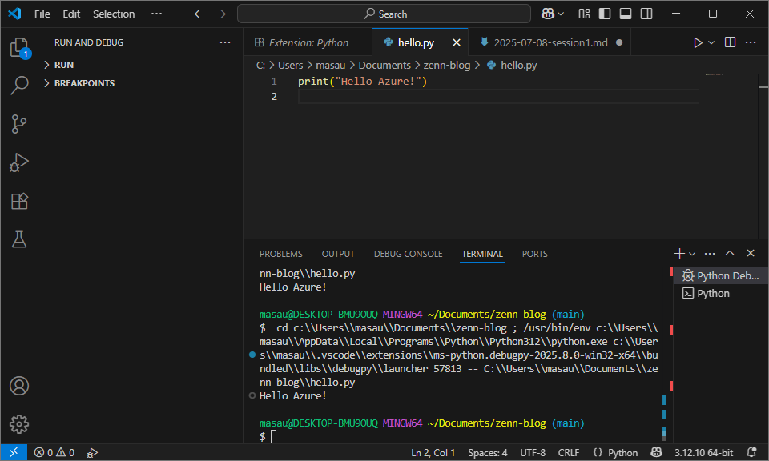

## TL;DR
- **Python 3.12 / VS Code / 拡張 3 点** を 40 min でセットアップ  
- `hello.py` が **UTF-16 文字化け → UTF-8 保存で解決**  
- Git push で **“fetch first” 衝突 → `git stash`→`pull --rebase`→`pop`** で突破  
- コスト ¥0

---

## 1. 今日のゴール
| 項目 | 内容 |
|------|------|
| 環境構築 | Python 3.12 と VS Code を導入・拡張インストール |
| 動作確認 | `hello.py` で “Hello Azure!” を出力 |
| Git 管理 | main へ push → Zenn 自動公開 |
| コスト | ¥0 |

---

## 2. 手順ハイライト (40 min)

```powershell
# Python & VS Code
winget install -e --id Python.Python.3.12
winget install -e --id Microsoft.VisualStudioCode

# Zenn プロジェクトは Day0 で作成済み
code .

# VS Code 拡張 (GUI): Python / Jupyter / Pylance

# テストスクリプト
echo 'print("Hello Azure!")' > hello.py
```

VS Code上で hello.py を実行 => Hello Azure!

```powershell
# Git push
git add hello.py .gitignore
git commit -m "session1: python env"
git push
```

---

## 3. つまずき & 解決
| トラブル | 原因 |	処置
| SyntaxError: Non-UTF-8 code … | hello.py が UTF-16 LE で保存されていた | VS Code ▶ Save with Encoding → UTF-8 |
| git push → rejected (fetch first) | GitHub で README 編集してリモートが進んでいた | git stash → git pull --rebase → git stash pop → コンフリクト解決後 push |

---

## 4. 実行結果スクリーンショット


---

## 5. 今日のコスト
| 項目 | in | out | ¥ |
|Python / VS Code | – |	– | 0 |

累計 ¥0 / ¥3,500（残 ¥3,500）

---

## 6. 学びメモ
winget コマンドを使用することで、Python & VS Code がインストールできる
PythonはデフォルトエンコーディングとしてUTF-8を使用⇒Pythonでコードを書く際にはUTF-8 保存を徹底
.gitignoreはGitリポジトリで追跡したくないファイルやディレクトリを指定するためのファイル
git pull --rebaseはコミット履歴をきれいに保ち、チーム開発での連携をスムーズにするための便利なコマンドで、git stashは退避コマンド
⇒ごちらもリモート編集で使用するコマンド

## 7. 次回予告 (Session 2)
python -m venv .venv と pip install requests
GitHub API でスター数を取得 → JSON を整形
依存管理 (requirements.txt) と .venv 運用 Tips


質問・フィードバックはコメントでどうぞ！この記事は push だけで自動公開されています 🚀