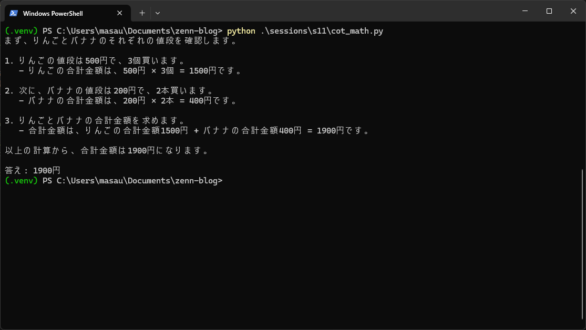

## 1. ゴール

| 項目          | 内容                                 |
| ----------- | ---------------------------------- |
| **Session** | 11                                 |
| **主題**      | Few‑Shot でフォーマットを固定し、CoT で推論精度を上げる |
| **成果物**     | `sessions/s11/*` ＋ 検証スクリーンショット     |
| **想定コスト**   | ≤ ¥1                               |

---

## 2. Few‑Shot で JSON 出力を固定する

### 2.1 `fewshot_json.py` のコアロジック

```python
few_shots = [
    {"role": "user", "content": "寿司の材料を JSON で"},
    {"role": "assistant", "content": '{"dish":"寿司","ingredients":["米","酢","わさび"]}'},
    {"role": "user", "content": "味噌汁の材料を JSON で"},
    {"role": "assistant", "content": '{"dish":"味噌汁","ingredients":["味噌","豆腐","わかめ"]}'},
]

resp = client.chat.completions.create(
    model=DEPLOY,
    messages=[
        {"role":"system","content":"必ず valid JSON のみ返す"},
        *few_shots,
        {"role":"user","content":f"{dish} の材料を JSON で"},
    ],
    temperature=0.0,
)
print(resp.choices[0].message.content)
```

> **解説**
>
> 1. 完成形の例を 2 件置くだけで *schema* が学習される
> 2. `temperature=0` でランダム性を排除
> 3. System で “valid JSON **のみ**” を強調


### 2.2 `no_fewshot_json.py`（比較用）

```python
resp = client.chat.completions.create(
    model=DEPLOY,
    messages=[
        {"role":"system","content":"料理アシスタントです。材料を答えて"},
        {"role":"user","content":f"{dish} の材料を JSON で"},
    ],
    temperature=1.0,
)
print(resp.choices[0].message.content)
```

> **意図的に System を緩め & `temperature` を高めて崩れやすく**
> Few‑Shot の効果を際立たせるベースライン。



### 2.3 自動評価結果


```
Name     Count
----     -----
Yes, OK      5
No, NG       5
```

Few‑Shot 側は **100 % JSON 合格**、無しは全崩壊 —— フォーマット誘導の威力が数字で可視化できた。

---

## 3. Chain‑of‑Thought で数的推論を改善する

### 3.1 `cot_math.py`（CoT あり）

```python
prompt = (
  "次の算数問題を Chain‑of‑Thought で解き、最後に必ず"
  "『答え: <数字>円』と半角数字で書いてください。\n"
  f"問題: {question}"
)
resp = client.chat.completions.create(
  model=DEPLOY,
  messages=[{"role":"user","content":prompt}],
  temperature=0.2,
  max_tokens=256,
)
print(resp.choices[0].message.content)
```

> * *思考開示 → 結論* を強制
> * 出力末尾の数字を正規表現で抽出して採点

### 3.2 `no_cot_math.py`（CoT なし）

```python
prompt = f"{question}"
resp = client.chat.completions.create(
    model=DEPLOY,
    messages=[{"role":"user","content":prompt}],
    temperature=0.2,
)
print(resp.choices[0].message.content)
```

### 3.3 検証結果（正規表現未調整）

```
Question                                GT   CoT   No
500円…                                   1900  None  None
700円…                                   3080  None  None
✔︎ 正答   CoT=0/2 | NoCoT=0/2
```

> **Issue**: モデルは正しい計算を返すが、`答え:` 行が全角数字・カンマ混在で抽出に失敗。
> 正規表現を `([0-9,０-９]+)` へ拡張予定。

---

## 4. GitHub 反映手順

```powershell
git checkout -b session/11-fewshot-cot
git add sessions/s11 images/s11-fewshot-summary.png run_eval_math.ps1
git commit -m "docs: session11 few‑shot & cot"
git push -u origin session/11-fewshot-cot
# PR → Rebase & merge → main 更新
```

---

## 5. つまづきメモ

| 症状                            | 解決策                                      |
| ----------------------------- | ---------------------------------------- |
| `KeyError: 'Q'`               | `math.csv` ヘッダー `Q,A` を確認・BOM なしで保存      |
| `ModuleNotFoundError: openai` | venv がアクティブか `sys.executable` で子プロセス呼出し  |
| `UnicodeDecodeError`          | `errors="replace"` で CP932 → UTF‑8 化けを無視 |
| CoT 抽出失敗                      | RegEx を `r"答え[:：]?\s*([0-9,０-９]+)"` に拡張  |

---

## 6. ここまでの学び

| テクニック        | 効果              | 注意点                   |
| ------------ | --------------- | --------------------- |
| **Few‑Shot** | 少数例でフォーマットを完全制御 | 例が多過ぎると Token & コスト増大 |
| **CoT**      | 推論過程を促し精度向上     | 後処理 (抽出) の設計がボトルネック   |

---

## 7. 次回予告

**Session 12** は Few‑Shot & CoT を **Function Calling** と組み合わせ、JSON 抽出を完全自動化するパイプラインを構築します 🚀
